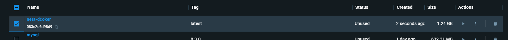
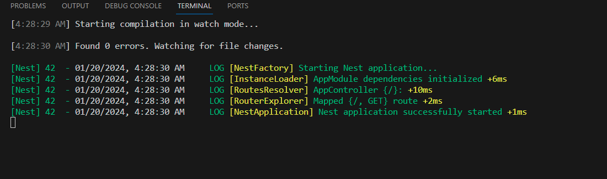
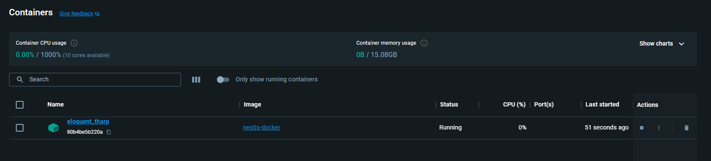
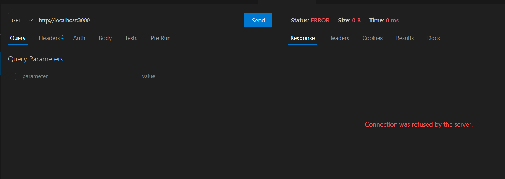
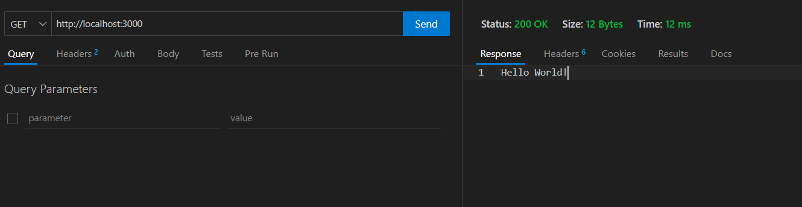
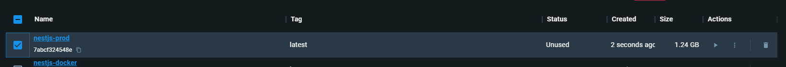

<p align="center">
  <a href="http://nestjs.com/" target="blank"></a>
</p>

[circleci-image]: https://img.shields.io/circleci/build/github/nestjs/nest/master?token=abc123def456
[circleci-url]: https://circleci.com/gh/nestjs/nest

  <p align="center">A progressive <a href="http://nodejs.org" target="_blank">Node.js</a> framework for building efficient and scalable server-side applications.</p>
    <p align="center">
<a href="https://www.npmjs.com/~nestjscore" target="_blank"></a>
<a href="https://www.npmjs.com/~nestjscore" target="_blank"></a>
<a href="https://www.npmjs.com/~nestjscore" target="_blank"></a>
<a href="https://circleci.com/gh/nestjs/nest" target="_blank"></a>
<a href="https://coveralls.io/github/nestjs/nest?branch=master" target="_blank"></a>
<a href="https://discord.gg/G7Qnnhy" target="_blank"></a>
<a href="https://opencollective.com/nest#backer" target="_blank"></a>
<a href="https://opencollective.com/nest#sponsor" target="_blank"></a>
  <a href="https://paypal.me/kamilmysliwiec" target="_blank"></a>
    <a href="https://opencollective.com/nest#sponsor"  target="_blank"></a>
  <a href="https://twitter.com/nestframework" target="_blank"></a>
</p>
  <!--[](https://opencollective.com/nest#backer)
  [](https://opencollective.com/nest#sponsor)-->

## Description

[Nest](https://github.com/nestjs/nest) framework TypeScript starter repository.

## Installation

```bash
$ npm install
```

## Running the app

```bash
# development
$ npm run start

# watch mode
$ npm run start:dev

# production mode
$ npm run start:prod
```

## Test

```bash
# unit tests
$ npm run test

# e2e tests
$ npm run test:e2e

# test coverage
$ npm run test:cov
```

## Support

Nest is an MIT-licensed open source project. It can grow thanks to the sponsors and support by the amazing backers. If you'd like to join them, please [read more here](https://docs.nestjs.com/support).

## Stay in touch

- Author - [Kamil Myśliwiec](https://kamilmysliwiec.com)
- Website - [https://nestjs.com](https://nestjs.com/)
- Twitter - [@nestframework](https://twitter.com/nestframework)

## License

Nest is [MIT licensed](LICENSE).


## To Dockerize the app

first create a dockerfile in the root directory of the project

```bash
touch Dockerfile
```

then create the docker ignore file

```bash
touch .dockerignore
```

```Dockerfile
FROM node:21

WORKDIR /user/src/app

COPY . .

RUN npm install

CMD [ "npm", "run","start:dev" ]
```

```dockerignore
node_modules
test
.gitignore
.git
.prettierrc
Dockerfile
README.md 
```

let's build the image

```bash
docker build -t nestjs-docker .
```



it will create an image with the name nestjs-docker


let's run the image

```bash
docker run nestjs-docker
```




let's make a request to the app



we can see that the app is running on the docker container
but we can't access it from the browser because it's running on the docker container

let's remove the running container

```bash
docker rm -f <container id>
```

then let's run the container again but this time we will map the port 3000 of the container to the port 3000 of the host machine

```bash
docker run -p 3000:3000 nestjs-docker
```



now when we change the code in the app it will not be reflected in the container because we are not mounting the code to the container.

let's create a prod docker file

```Dockerfile
FROM node:21

WORKDIR /user/src/app

COPY . .

RUN npm install

RUN npm run build

RUN rm -rf .src

EXPOSE 3000

CMD [ "npm", "run","start:prod" ]
```

```bash
docker image build -t nestjs-prod -f Dockerfile.prod .
```



let's run the image

```bash
docker run -p 3000:3000 nestjs-prod
```